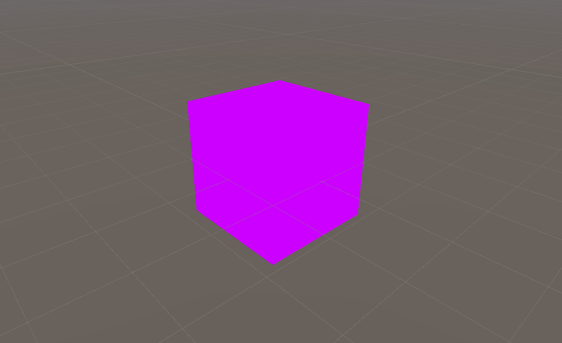

**The University of Melbourne**

# COMP30019 – Graphics and Interaction

## Workshop 5

# Introduction:

In this workshop you will do some basic shader programming using
Unity's built-in rendering pipeline. 
Shader programs are executed on the GPU rather
than the CPU, and in Unity are typically written in a C-like language called
High-Level Shader Language ([HLSL](https://docs.unity3d.com/Manual/SL-ShaderPrograms.html)). This workshop is only a very 
basic introduction to shaders. However, in a couple of weeks
you will learn how to implement a full per-pixel lighting 
model inside a shader, so don't fall behind!

The workshop comes with the following assets:

* **MainScene.unity** – The scene you should open and work with for the entire workshop.
* **GenerateCube.cs** – The same cube mesh generator from [workshop 2](https://github.com/COMP30019/Workshop-2), with some
  added _UV coordinates_.
* **SolidColorShader.shader** – A very simple shader that draws objects as a solid colour. 
* **TextureShader.shader** – A shader with texture capabilities.
* **CubeTexture.png** – A texture image that we want to map to
  faces of the cube.

> **Note** <br>
> For historical reasons HLSL might sometimes be called [Cg](https://en.wikipedia.org/wiki/Cg_(programming_language)),
> or simply Cg/HLSL. While
> Cg and HLSL are not _exactly_ the same languages, you can essentially treat them
> as such while writing vertex and pixel shaders in Unity. The divergence between the two 
> only really impacts more "modern" shader types which we won't explore in workshops. 
> An important thing to note is that
> Cg is no longer developed, but HLSL is actively maintained by Microsoft as 
> the shader language for DirectX APIs. 

### Tasks:

#### 1. Assign a shader within a script

Open `MainScene.unity` in Unity. As usual, press 'Play' and take a look at
the generated cube. It should be pretty striking as it'll be rendered pink! 
There are many
causes for a bright pink render, 
but in almost all cases, it's related to a shader
issue. For example, a shader not compiling. In this particular case,
it's because the cube's material does not have an assigned shader.

Your first task is to
modify `GenerateCube.cs` to assign `SolidColorShader.shader` to the cube’s
material. Notice that it's currently set to `null` in the `Start()` method.
For maximum re-use, define a serialized field with the type `Shader`. The
[`Shader`](https://docs.unity3d.com/ScriptReference/Shader.html) class 
can reference a shader asset, and any `*.shader` asset may be "dragged" 
to the respective field in
the inspector (like you've seen for other asset types). When you are successful, 
the cube should be rendered "solid black".

<p align="center">
  
</p>

#### 2. Mystical materials

Ensure play mode is _off_, and take a look at the cube's 'Mesh Renderer' component
in the inspector. You'll notice that there is no assigned material! Now enter
play mode again, and look at how this field automatically changes to 
`Default-Material (Instance)`. Somehow the cube assumes a material on play
even though we didn't assign a material asset in the inspector!

It turns out the mere _accessing_ of the material in
`GenerateCube.cs` is enough to create an _instance_ of the "default" material
that ships with Unity. This means we can modify this material, and these
modifications will be unique to this particular object (mesh renderer instance). 
A similar thing occurs if an existing material is already 
assigned to an object. In that case, a _clone_ of that material is created
unique to that object. This might seem like a waste of memory, but it's by design; in most cases
modifying a material via a script is done with the intention of
changing a visual property unique to that particular object _instance_.

> **Warning** <br>
> You might notice there is a `sharedMaterial` field in
> the `MeshRenderer` component that permits modifying the _original_
> material instance. Use this only if you know what you're doing. 
> Ending play mode _won't_ restore
> the original material asset's settings like you might expect
> (i.e., this is a great way to accidentally lose work!).

So what exactly _is_ a material in Unity, 
and how does it relate to shaders? 
One way to think about a material 
is simply as a "proxy" for a shader, where parameters related to the shader's
functioning are fine-tuned for a particular effect. 
These parameters are called _properties_, and are made 
available within the respective shader program implicitly via the `Material`
instance.
Importantly, different materials might share
the same shader, but pass _unique_ parameters to customise the shader's 
output on a per-object basis.
In other words, to render an object,
you describe the "what" via a material, and the "how" is driven 
via the shader within.
Note that in some cases a shader is so
simple, or _would-be_ properties are essentially "hard coded" within the shader, 
that the material's 
only utilised "field" is the shader itself. This is what we see 
in this particular
example, but task 4 will change that. 

Note that the `Material` class acts as a 
gateway between your CPU-based 
C# components, and GPU-based code (shaders). Check out the Unity [docs](https://docs.unity3d.com/ScriptReference/Material.html)
for the `Material` class
and you'll see several "setter" methods such as `SetFloat()` and `SetVector()`. 
These allow you to dynamically change properties available 
within the assigned shader, allowing you to (for example) change the colour of
an object's _surface_ according to in-game events. 

#### 3. Add some colour!

Let's actually write (well, modify) some shader code! Open the shader program
assigned to the cube's material. You can find it in the assets folder 
(`SolidColorShader.shader`), and double clicking it should open it in your 
already configured code editor.
Your task is to modify the fragment/pixel shader such that the cube is 
solid yellow instead.

After doing this, carefully study the _full_ shader file. Note that this is not
_just_ a Cg/HLSL shader, it's also wrapped by Unity's very own [ShaderLab](https://docs.unity3d.com/Manual/SL-Reference.html) code. 
Importantly, ask yourself the following:

* Which code is ShaderLab code, and which is Cg/HLSL? How can you tell?
* What `Mesh` data structure does the `POSITION` semantic 
  in the `vertIn` structure correspond to (i.e., in `GenerateCube.cs`)?
* In the vertex shader, what does `mul(UNITY_MATRIX_MVP, v.vertex)` do?


<p align="center">
  
</p>


#### 4. Uniform variables

Instead of hard coding an output colour into the pixel shader, 
let's create a property so that we can modify it within a C# component on
the CPU side
(i.e., via the cube's material). Declare a `uniform` variable within the Cg/HLSL
code that will represent the colour property like so:

```HLSL
uniform float4 _Color;
```

Notice the HLSL _type_ `float4` is used, which is a very flexible type
that can represent any sort of vector-like data. A colour fits
this bill -- each component will 
correspond to the red (x), green (y), blue (z) and
alpha (w) channels of the colour respectively.

> **Note** <br>
> A `uniform` variable
> has the _same_ value for every vertex and every pixel when the shader program
> runs. In a way this is just a "global" variable, and
> in fact, the `uniform` [storage-class modifier](https://docs.microsoft.com/en-us/windows/win32/direct3dhlsl/dx-graphics-hlsl-variable-syntax)
> is optional in this context.

Now that you've defined the property, write a C# component to change the
colour of the cube on every frame (for an extra challenge, try to cycle through
the [hue](https://docs.unity3d.com/ScriptReference/Color.HSVToRGB.html) like we have done below). 
One way to do so is via the cube 
material's [`SetColor()`](https://docs.unity3d.com/ScriptReference/Material.SetColor.html)
method. The name _string_ of the property must correspond to the name of
the variable declared in the shader, namely `"_Color"`.

<p align="center">
  
</p>

> **Note** <br>
> You can also use the [`color`](https://docs.unity3d.com/ScriptReference/Material-color.html)
> attribute of the material to do this. It turns out (by default) a
> shader variable with the name `_Color` is uniquely mapped to this 
> built-in material field!

#### 5. Vertex colours

Uniform properties are very useful, but obviously limited. For example, 
how do we pass data to our shader on a per-vertex basis? 
It turns out arrays within the `Mesh`
class map to the shader _semantics_ that tag `vertIn` shader structure
variables. 
Recall how you defined meshes in previous weeks. We of course had to 
define the vertex positions, but we also defined
vertex _colours_ which corresponded to positions one-to-one (by index). 

Once uploaded to the GPU, which is an internal Unity process, these
arrays are "zipped" together and made available on a per-vertex basis in your shaders
via the `vertIn` structure. The glue here is the _semantics_ that are
used to tag shader input structures. For example:

- `POSITION` - binds to the `vertices` array in a `Mesh`, set via [`SetVertices()`](https://docs.unity3d.com/ScriptReference/Mesh.SetVertices.html).
- `COLOR` - binds to the `colors` array in a `Mesh`, set via [`SetColors()`](https://docs.unity3d.com/ScriptReference/Mesh.SetColors.html).

In lieu of the above, your next task is to modify the shader to utilise the vertex colours defined in `GenerateCube.cs`.
You will need to of course modify the
structures `vertIn` and `vertOut`, as well as make small 
modifications to the
vertex and fragment shaders themselves. 

<p align="center">
  
</p>

Once this is done, change any single vertex colour in `GenerateCube.cs` so that one triangle does
not have all identical vertex colours. Notice how there is a gradient
effect on the rendered triangle (you most certainly did not "code" this effect
in your shader!). Which step in the rendering pipeline facilitates this?

<p align="center">
  
</p>

#### 6. Introduction to textures

Vertex colours are still a fairly "basic" way to colour a mesh. Depending on the
desired look and feel of our graphical application, we
may wish to instead use a _texture_. A texture is an image
which is "wrapped" onto a mesh surface. We map positions on the texture
to vertices by  specifying _UV coordinates_
for every vertex. This is a one-to-one mapping, exactly like vertex colours!
Yes, there's a shader semantic dedicated to this as well:

- `TEXCOORD0` - binds to the `uvs` array in a `Mesh`, set via [`SetUVs()`](https://docs.unity3d.com/ScriptReference/Mesh.SetUVs.html).

> **Note** <br>
> A UV coordinate is a _normalised_ position on a texture, not an exact pixel
> coordinate on the underlying image.
> In Unity, the UV coordinate `(0.0, 0.0)` represents the colour at the
> bottom-left of the texture, `(0.5, 0.5)` represents the colour in the middle of
> the texture, and `(1.0, 1.0)` represents the colour at the top-right of the
> texture.

You have already been given a shader with basic texture
capacities (`TextureShader.shader`). First, open it up in your code editor
and study it. 
Then, reassign the serialized field 
in `GenerateCube.cs` to use this shader.
If you enter play mode again, you'll see that the cube is rendered white. 
This is a "fallback" texture, as we haven't actually passed one to the shader!

It turns out a texture may be passed as a uniform parameter (notice the `_MainTex`
variable in the shader).
So, you’ll also need to use the `SetTexture()` (or `mainTexture` field)
method on the material
such that it references a `Texture`
object. Like with the shader in the first task, you may use a serialized field to reference
a `Texture` asset within the editor. We have already set up `CubeTexture.png`
to be a texture asset which can be dragged into the respective inspector field.

Once you've assigned the texture, you should 
notice the cube is textured, 
but not _every_ face is mapped correctly. Your final task here is to fix the
erroneous UV coordinates in `GenerateCube.cs`. This is somewhat tedious, as was
manually figuring out vertex positions in previous weeks, but it's a great
exercise for consolidating your understanding UV coordinates. 

<p align="center">
  
</p>

#### 7. Best of both worlds (challenge)

Write a shader that _blends_ both texture and vertex colour outputs. This will
need to be done in a pixel/fragment shader. For
a given pixel, if `ct` is the sampled texture colour and `cc` is the interpolated
vertex colour, then the output should be `ct * f + cc * (1 - f)`, where `f` is
the _blending factor_. Start off with `f` being hardcoded as `0.5`. Then, for an
extra challenge, make `f` a uniform parameter of the shader, 
and write a C# component to oscillate between the two effects using a `sin()`-like
function.

<p align="center">
  
</p>

